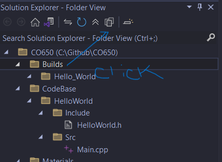
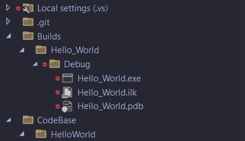

To access the build .exe, .lib, .dll, etc.. files

go to:

> ../Builds/NameofDir or Application/

`Frame1` - shows where to click in the Solution Explorer to reveal hidden files.

`Frame2` - shows the actual hidden files. which are represented by an red dot next to the file/folder/etc...

[Home Page](../README.md) 