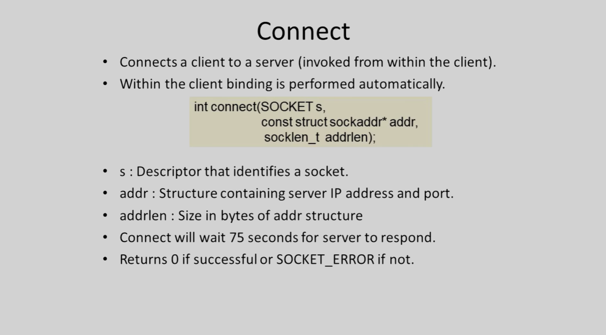

# Introduction - Winsock & Network Fundamentals

## Overview

- Sockets were initially developed for Unix systems.
- Winsock is Windows implementation of sockets.
- Window Sockets API (`WSA`)
- ws2_32.dll location - (C:\WINDOWS\System32)
- Winsock 2 extends Winsock 1.1 support for several protocols.

## Network Protocol Stack

### Architecture 

- The connection is always between two devices, and each side uses its own IP and port number. usually:
	- **Client:** The Sender & requester of server data.
	- **Server:** The Provider & processor of data.

For the **Server's** job consists of the following:
	- Primary: Listing - for incoming request from client applications. with their IP/port number.
	- Secondary: Process & Store Client data.

## IP Address, Sockets, & Ports

### Overview 

- both Server & client use IP/Port to communicate.
- Machines can have mere than 1 NIC or (network interface card).
- the Look-back Address is 124.0.0.1 for both the server & client when testing.

### Ports Section

- port # (16 bit address) can be any integer from 1 to 65,535.
- Ports 1..1023 are described as well known ports and are reserved for specific applications (port 21 FTP)
- is recommended to choose a number over 1024. To be (almost) sure that your descried port isn't already in use.

### Sockets 

- **Definition:** "A pipe between to computers an a network thought which data flows" (Mulholland 2004).
- Almost all data and process flow thought an Socket within [**WinSock**](https://learn.microsoft.com/en-us/windows/win32/winsock/windows-sockets-start-page-2).
- They are both-sided since data can flow between on a single socket.
- There are 2 common types for a socket:
	1. Streaming socket **(SOCK_STREM) TCP**
	2. Datagram socket **(SOCK_DGRAM) UDP**

## Socket Binging & Precessing 

An server creates a new socket throw which client Applications can talk to. By an IP & Port.

Example:

> **IP Address:** 192.168.1.1 \
	**Port:** 55555

after an socket is bound, its now time for it to listen for incoming requests.
An Client needs to create is own local socket within the same network. in this instance 

> IP Address : 192.168.1.1\
	Port : 1034\
	can be a valid IP. simply being in the same network range of (192.168.X.X).

this Action makes it possible for the server to talk to an client App/s. 

### Server/Client Functions

***Server:***
1. initialize WZA - `WSAStartup()`.
2. Create a socket - `socket()`.
3. Bind the socket - `bind()`.
4. listen on the socket - `listen()`.
5. Accept a connection - `accept(), connect()`.
6. Send & receive data - `recv(), send(), recvfrom(), sendto()`.
7. Disconnect - `closesocket()`.

***Client:***
1. initialize WZA - `WSAStartup()`.
2. Create a socket - `socket()`.
3. connection to server- `connect()`.
4. Send & receive data - `recv(), send(), recvfrom(), sendto()`.
5. Disconnect - `closesocket()`.

#### Server Code Overview

> [!NOTE]
> For now i will just copy the slides here from now-on. At a later date I will right them down \
	but if someone has time i would gladly add you the contributors. \
	\
	if any other questions or suggestions please use the the discussions tab in the repo. thanks.

**STEP - 1 & 2**

the following goes in detail over The Server/Client function steps - Now that `WSAStartup()` has been detailed.

**STEP - 3**

**STEP - 4**

#### Client Code Overview

**CLIENT~STEP - 3: Connect**

## Summary

